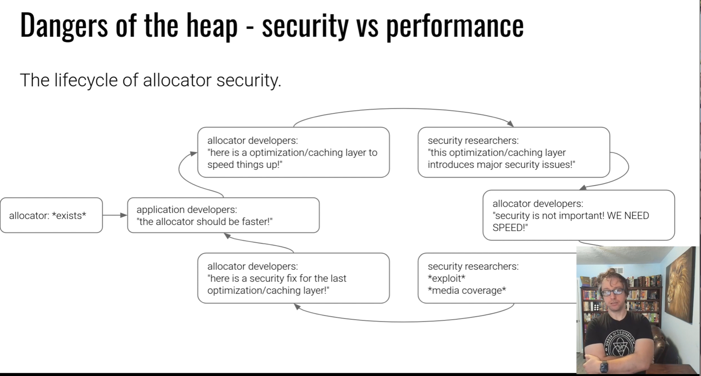

## 0x01 简介

1.[各种段的作用](../Notes/Linkers&Loaders02/)

ELF .plt:库函数插桩所在；

ELF .got:输入符号指针

.bss：**未初始化** 数据；

### 2.mmap缺点

- 1.分配字节数必须是4096字节的倍数，只能以内存页为单元管理内存，经过内核很慢。 

3.按需分配内存，

- dllmaloc，Doug Lea开发并发布到公共社区；

- Linux的glibc里的**ptmalloc**(Posix Thred aware fork of dllmalloc),

  malloc的多线程实现

- FreeBSD里的jemalloc(被用在Firefox,Android)

- Windows里的Segment heap,NT heap

- kmalloc(linux内核内存分配器)，kalloc(ios内存分配器)

有动态分配器管理的内存-->堆。

C++程序，函数scanf、printf都要使用堆。

### 4.ptmalloc/glibc提供的对堆的管理函数

```
malloc() 分配内存
free() 释放之前申请的内存块
realloc() 分配后改变分配的尺寸
calloc()分配并把内存清零
```

为什么要有calloc？因为未初始化的数据可能导致data disclosure。

### 5.现代化的技术

ASLR(Adress Space Layout Randomlization, 地址空间布局随机化)

NX

PIE

RELRO

Stack Canary

### 6.Data Segment

- ptmalloc在分配小内存时不使用mmap，用另一种内存管理方法brk() ；在大片分配时使用mmap；

- 一开始从零开始
- 由系统调用`brk`和`sbrk`管理，或许这两个 系统调用不再遵循POSIX标准。
  - sbrk(NULL) return 数据段的当前末尾
  - sbrk(num)  扩充当前数据段num个字节
  - brk(addr ) 扩充当前数据段一直到addr位置

写一段测试代码，捕捉malloc的场景，不要使用printf和puts，因为其内部可能会使用malloc；

```c
char msg[]="Start malloc()!";
int main(int argc,char** argv){
        write(1,msg,strlen(msg));
        malloc(16);
}
```

### 7.为什么堆带来了危险？

程序员：

忘记释放内存？

忘记指针所指；

忘记已经释放的内存有哪些；

堆管理器：追求性能，安全之后再考虑。

### 8.一些检测和防御手段

Valgrind使用测试样例找到一些通常 错误，比如忘记释放内存，资源耗尽；

glibc的严格模式：  会让程序变慢

- export MALLOC_CHECK=1
- export MALLOC_PERTURB=1
- export MALLOC_MMAP_THRESHOLD=1 #所有内存分配都通过，仍旧可以绕过

## 0x02 Dynamic Allocator Misuse

>https://www.bilibili.com/video/BV1zW4y1f7cB

任何分配器、库和函数的使用都有开销overhead，分配器开发者为了速度引入optimization和cache，只保证速度，正确的使用堆由程序员确保，由此便带来安全问题。



