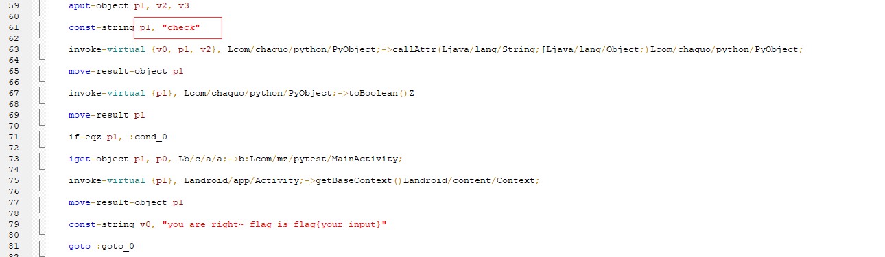
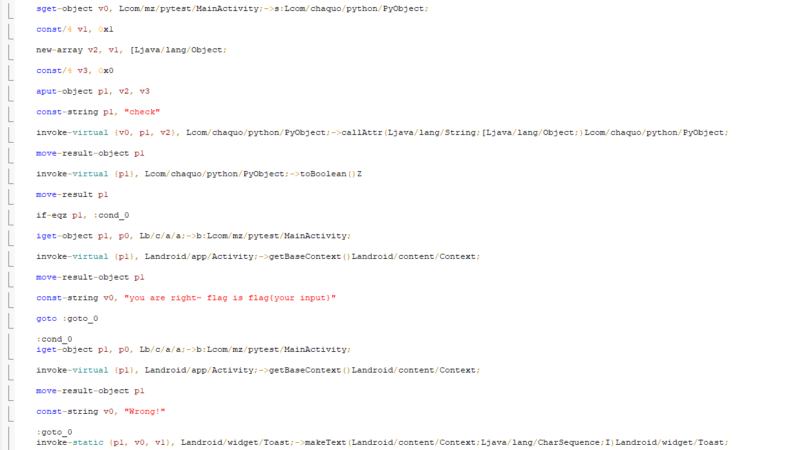
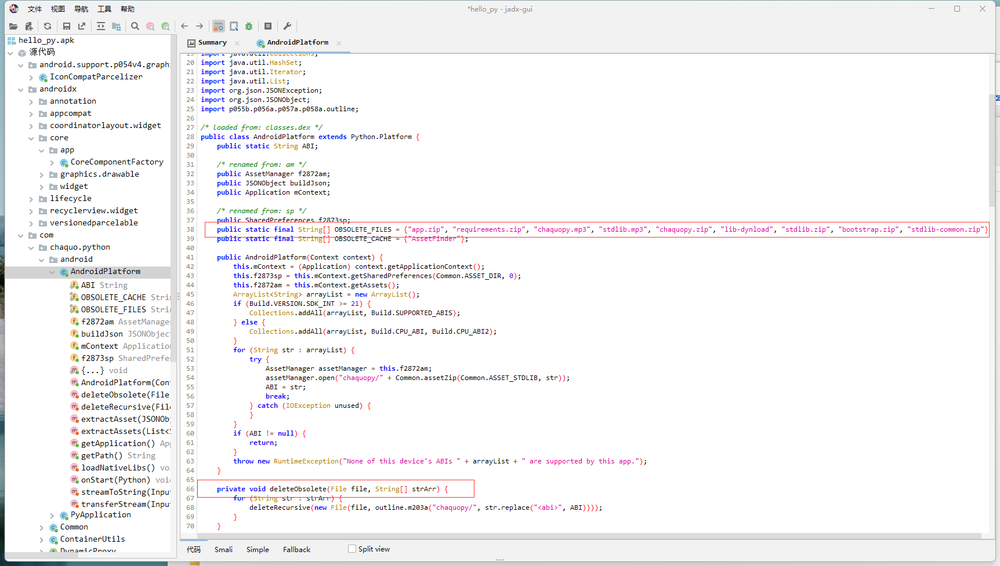
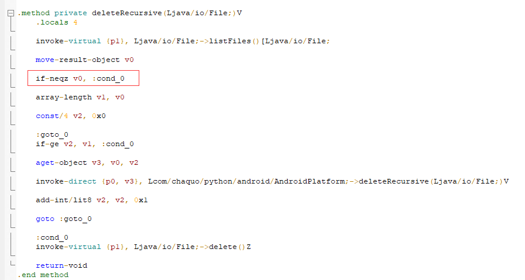
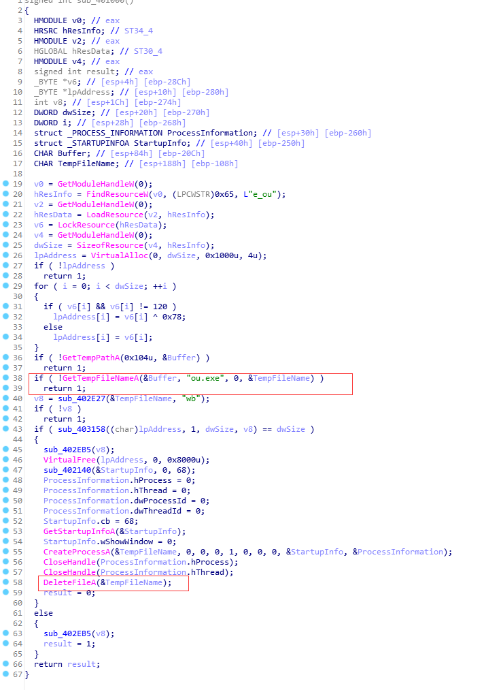
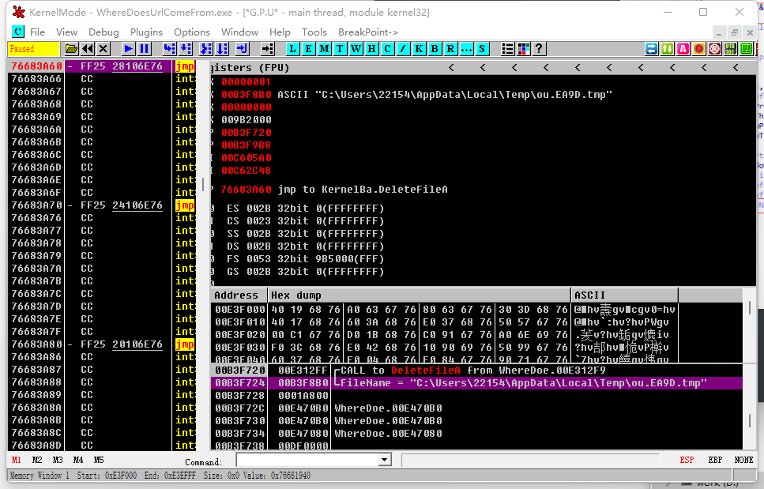
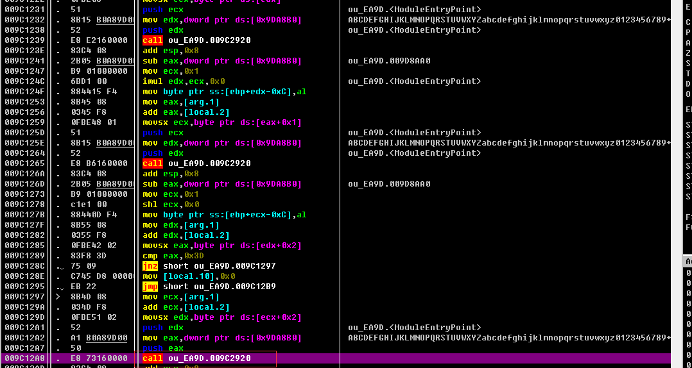

## Hello Py

字符串搜索特征字符串，

比如flag、right、wrong、!，然后找到了如下的代码、



p1的值决定了flag是否正确。

确定关键虚拟函数。



关键逻辑check在Python代码；

Lcom/chaquo/python/PyObject;看了一圈什么内容都没有，py文件应该在其他文件里；

使用jax反编译，然后在AndroidPlatform.java文件里，发现有释放文件和删除文件操作。



修改smali代码，让它不要删文件。



发现编译失败，我的环境不行；

没办法，去资源目录里，突然看到app.yml居然没有被删除，可以直接读取，把它修改为zip后缀，然后解压得到hello.py文件。

```python

import struct #line:3
import ctypes #line:4
def MX (arg1 ,arg2 ,arg3 ,arg4 ,arg5 ,arg6 ):#line:7
    temp =(arg1 .value >>5 ^arg2 .value <<2 )+(arg2 .value >>3 ^arg1 .value <<4 )#line:8
    OOO0OOOOOO0O0OO00 =(arg3 .value ^arg2 .value )+(arg4 [(arg5 &3 )^arg6 .value ]^arg1 .value )#line:9
    return ctypes .c_uint32 (temp ^OOO0OOOOOO0O0OO00 )#line:11
def encrypt (arg1 ,arg2 ,arg3 ):#line:14
    delta =0x9e3779b9 #line:15
    rounds =6 +52 //arg1 #line:16
    O00OO00000O0OO00O =ctypes .c_uint32 (0 )#line:18
    OO0OOOO0O0O0O0OO0 =ctypes .c_uint32 (arg2 [arg1 -1 ])#line:19
    OOOOO00000OOOOOOO =ctypes .c_uint32 (0 )#line:20
    while rounds >0 :#line:22
        O00OO00000O0OO00O .value +=delta #line:23
        OOOOO00000OOOOOOO .value =(O00OO00000O0OO00O .value >>2 )&3 #line:24
        for OO0O0OOO000O0000O in range (arg1 -1 ):#line:25
            OOO0OO00O0OO0O000 =ctypes .c_uint32 (arg2 [OO0O0OOO000O0000O +1 ])#line:26
            arg2 [OO0O0OOO000O0000O ]=ctypes .c_uint32 (arg2 [OO0O0OOO000O0000O ]+MX (OO0OOOO0O0O0O0OO0 ,OOO0OO00O0OO0O000 ,O00OO00000O0OO00O ,arg3 ,OO0O0OOO000O0000O ,OOOOO00000OOOOOOO ).value ).value #line:27
            OO0OOOO0O0O0O0OO0 .value =arg2 [OO0O0OOO000O0000O ]#line:28
        OOO0OO00O0OO0O000 =ctypes .c_uint32 (arg2 [0 ])#line:29
        arg2 [arg1 -1 ]=ctypes .c_uint32 (arg2 [arg1 -1 ]+MX (OO0OOOO0O0O0O0OO0 ,OOO0OO00O0OO0O000 ,O00OO00000O0OO00O ,arg3 ,arg1 -1 ,OOOOO00000OOOOOOO ).value ).value #line:30
        OO0OOOO0O0O0O0OO0 .value =arg2 [arg1 -1 ]#line:31
        rounds -=1 #line:32
    return arg2 #line:34

def check (O0000000000O0O0O0 ):#line:63
    print ("checking~~~: "+O0000000000O0O0O0 )#line:64
    O0000000000O0O0O0 =str (O0000000000O0O0O0 )#line:65
    if len (O0000000000O0O0O0 )!=36 :#line:66
        return False#line:67
    O00OO00000OO0OOOO =[]#line:69
    for O0O0OOOOO0OOO0OOO in range (0 ,36 ,4 ):#line:70
        OO0OO0OOO000OO0O0 =O0000000000O0O0O0 [O0O0OOOOO0OOO0OOO :O0O0OOOOO0OOO0OOO +4 ].encode ('latin-1')#line:71
        O00OO00000OO0OOOO .append (OO0OO0OOO000OO0O0 )#line:72
    _O00OO0OOOOO00O00O =[]#line:73
    for O0O0OOOOO0OOO0OOO in O00OO00000OO0OOOO :#line:74
        _O00OO0OOOOO00O00O .append (struct .unpack ("<I",O0O0OOOOO0OOO0OOO )[0 ])#line:75
    print (_O00OO0OOOOO00O00O )#line:77
    OO0OO0OOO000OO0O0 =encrypt (9 ,_O00OO0OOOOO00O00O ,[12345678 ,12398712 ,91283904 ,12378192 ])#line:78  n=9
    OOOOO0OOO0OO00000 =[689085350 ,626885696 ,1894439255 ,1204672445 ,1869189675 ,475967424 ,1932042439 ,1280104741 ,2808893494 ]#line:85
    for O0O0OOOOO0OOO0OOO in range (9 ):#line:86
        if OOOOO0OOO0OO00000 [O0O0OOOOO0OOO0OOO ]!=OO0OO0OOO000OO0O0 [O0O0OOOOO0OOO0OOO ]:#line:87
            return False#line:88
    return True#line:90
def sayHello ():#line:92
    print ("hello from py")#line:93
```

一开始想手写解密脚本，不知道为什么总是出错，解密出的值都是不可见字符，放弃。去csdn上找了一个公开的脚本：

链接如下：

https://blog.csdn.net/A951860555/article/details/120120400

```

     
 
from ctypes import c_uint32, c_int32
 
def MX(z, y, total, key, p, e):
    temp1 = (z.value>>5 ^ y.value<<2) + (y.value>>3 ^ z.value<<4)
    temp2 = (total.value ^ y.value) + (key[(p&3) ^ e.value] ^ z.value)
    
    return c_uint32(temp1 ^ temp2)
 
def decrypt(n, v, key):
    delta = 0x9e3779b9
    rounds = 6 + 52//n 
    
    total = c_uint32(rounds * delta)
    y = c_uint32(v[0])
    e = c_uint32(0)

    while rounds > 0:
        e.value = (total.value >> 2) & 3
        for p in range(n-1, 0, -1):
            z = c_uint32(v[p-1])
            v[p] = c_uint32((v[p] - MX(z,y,total,key,p,e).value)).value
            y.value = v[p]
        z = c_uint32(v[n-1])  
        v[0] = c_uint32(v[0] - MX(z,y,total,key,0,e).value).value
        y.value = v[0]  
        total.value -= delta
        rounds -= 1

    return v 
    n=9
v=[689085350 ,626885696 ,1894439255 ,1204672445 ,1869189675 ,475967424 ,1932042439 ,1280104741 ,2808893494 ]
k=[12345678 ,12398712 ,91283904 ,12378192 ]
result= decrypt(n,v,k)
print([hex(x) for x in result])
b_result=b''.join(struct.pack('<I',x) for x in result)
s_result=b_result#.decode('latin-1')
print('flag{'+str(s_result)+'}')

```

得到最终flag,b'c1f8ace6-4b46-4931-b25b-a1010a89c592'


## URL从哪儿来



不想在自己电脑上运行，丢沙箱里，结果沙箱不给文件。没办法，自己下Api断点，获取文件。



获取到文件后，strings发现有base64特征，动态加载后观察，发现关键判断函数。



001DF654  |006D7838  ASCII "ZmxhZ3s2NDY5NjE2ZS02MzY5LTYyNmYtNzE2OS03NDYxNzA2MTc3NjF9"

尝试b64解码，

flag{6469616e-6369-626f-7169-746170617761}

发现里面有flag，提交成功。