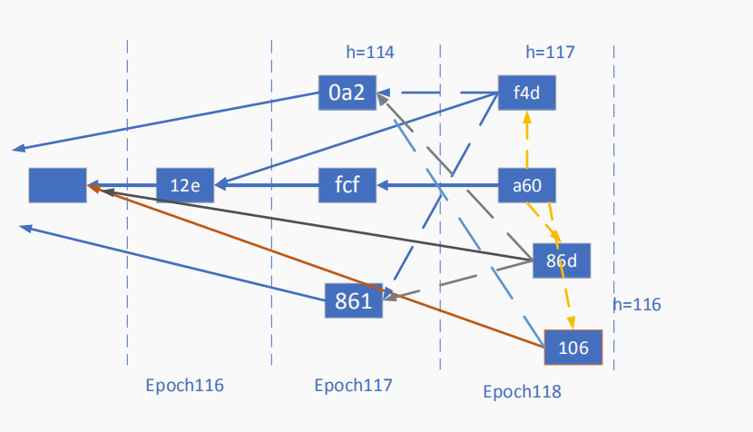
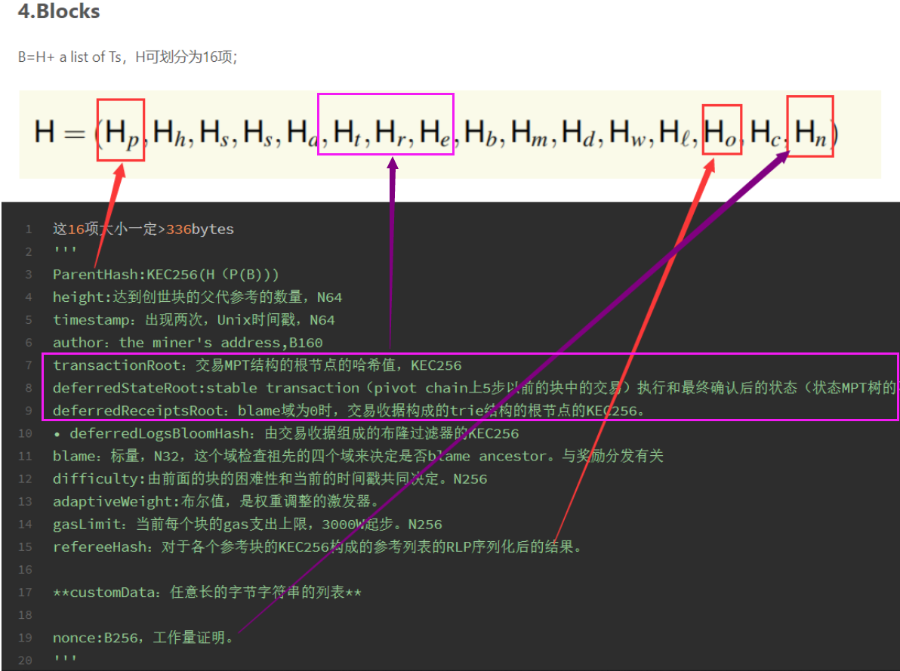
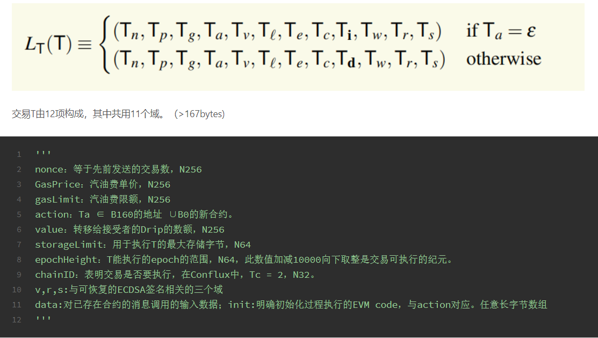
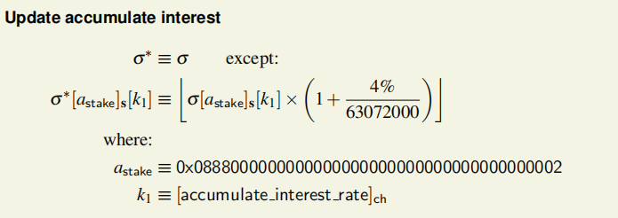

> 本文参考[Conflux白皮书](https://confluxnetwork.org/files/Conflux_Protocol_Specification_20201020.pdf)，Conflux的安全性证明论文[GHAST](https://arxiv.org/abs/2006.01072)

[TOC]

## 1.PoW problem（Puzzle）

> 参考[Conflux白皮书](https://confluxnetwork.org/files/Conflux_Protocol_Specification_20201020.pdf)第9节以及附录F

### 1.1 简介 

MpEthash:Multi Point Ethash，**只拿块头做输入值。**
$$
PoW(H)=MpEthash(H) ≡ MpEthash(KEC(RLP(H_{-n})),H_{n},d) ≡ KEC(s_{h} ◦ m_{c})
$$


<!--more-->

其中，[RLP](http://www.memoryofsnow.xyz/2020/11/17/Conflux-Notebook4/)函数把区块头去除nonce部分**H-n**序列化为字节数组，之后用Keccak哈希算法求取值，与**nonce**（工作量证明的256位的值）和从H中推导出的**dataset**一道作为输入。

MpEthash的输出值等于一个KEC256值时，校验成功。512位长的种子哈希**s**h和256位长的压缩混淆数的连结的KEC256值。

#### 1.1.2 KEC256的安全性

找到一次随机碰撞需要2的128次尝试，找到特定碰撞需要2的256次方的尝试次数。

### 1.2 PoW Quality

一个区块的工作量证明质量指找到这样一个块的**期待工作量**。

**OFFSET(H)**是一个256位的标量，用一个区块头的nonce 的第1到第127位（序列索引值从0开始）后加128个0，即乘上2的128次。


表示工作量证明验证的偏移量。

区块B的质量指找到一个满足条件的新区块**B'**预期尝试次数，新区块的工作量证明值**PoW(H')**在**OFFSET(H)**和**PoW(H)**之间。


### 1.3 细则

**MpEthash算法路线图**

- 存在一个种子seed，通过扫描块头为每个块计算出来那个点。
- 根据这个种子seed，可以计算一个**Csize**的伪随机缓存cache，客户端存储这个缓存。
- 从这个缓存cache中，我们能够生成一个**dsize**的数据集，该数据集中的每一项都取决于缓存中的一小部分。完整客户端和矿工存储了这个数据集，数据集随着时间线性增长。
- 挖矿工作包含了抓取数据集的随机片以及运用哈希函数计算他们。校验工作能够在低内存的环境下完成，通过使用缓存再次生成所需的特性数据集的片段，所以你只需要存储缓存cache即可。

使用256字节的顺序访问，以便算法的每一轮总是从RAM获取整页


#### 0.EFNV压缩函数


N64 *×*N64 *→* N64


 

(N32)*∗* *×*N *→* N64


#### 3.计算mp和p

**H-n**可以表达成一个4元素的N64数组，借助H-n得到a、b、c、w。

借助**Hn**得到**nhigh**和**nlow**


#### 4.半混淆数的计算

**半混淆sh**是一个64字节bytes,B512。


借助第3步算出的**mp**得到sh。


#### 5.压缩混淆数的计算

借助第4步的sh、d、p。


mc的计算可从m0开始


**mj是由mj-1得到**


3.Ecompress将64字的**m32**（256bytes）压缩到8字的数组。


### 1.4 举例

例如，在ConfluxScan.io上找到的一个区块的哈希值为>0x8d3496f8181414015c6a156b1fb2b028b6583a29845fcd51c35231078ef630be,高度为3,904,120

它的难度是462,593,993,012，它找到的随机数是0xeea21f8e877b294c。

**它的父区块的随机数是0x28ec2a9e387d6bf2，只有64比特？？？**


是用64位长的16进制数表示。

即PoW(H)=0x2c7794a005924727112ebb0ad66a55f30625435013b2058ba85fbd524e9bed33


## 2.Difficulty Adjustment

> 参考[Conflux白皮书](https://confluxnetwork.org/files/Conflux_Protocol_Specification_20201020.pdf)第9节

调整困难性的目的是维持块出块速率符合预期，比如半秒一个块。


### 2.1 困难度的预设值

- 开始困难性Starting diffificulty (d0)为3×10^(4) = 30000，即创世块到高度为5000的块（包含高度为5000的块），困难性都设置为30000。
- 高度为**j**属于**[5000i+1,5000i+5000]的块设置为di**，其中di是一个256位以内的整数值
- 区块的块头的困难度表示成公式：


**注：高度h（height）为该块到达创世块所经历的parent edge边数**，所以主链上的块height=epoch值。但是被引用的不在主链上的块，它和epoch的值不一样，会相差0~4，但是可以肯定的是**h一定小于等于epoch值**。

下图是例图，是根据confluxscan上的3904116以后的块绘制的树图。



#### epoch困难度

只要被确定下来，epoch的困难度也就确定了下来。


### 2.2 理想的困难度估计值

**总结：出块速度与困难度设置成正比。**

理论办法：**di'/di-1=0.5blockps/实际出块速率；**

实际算法：

**过去5000个epoch的出块数量+开始和结束时期的块的平均时间戳——>估计当前所有矿工的算力——>设置接下来5000个epoch的目标困难度。**

这里的计算**基于本地视图，即当前块B的PAST(B)视图**，即先于B的所有块组成的树图，**PAST（B）不包括B本身**。


上一阶段的困难度 × **500ms（一个块的生成时间）**× 过去5000个epoch的出块数量÷  **上一阶段花的时间**（上一阶段的最后一个块的时间戳-上一阶段的块的时间戳的最小值）

其中，减去1是为了得到区块产生速率的**无偏估计值**。


### 2.3对于特定高度的块的难度调整

**算法思想：**

**困难度要调整以使出块速度和0.5s一块的预期速度吻合；但是，困难度不能太小，每次调整幅度不能过大，最多调整上个阶段困难度的一半。**


- 如果上一阶段**di-1**的难度值太小(小于理想的困难度**di'**的2/3)，当前设置困难度时就用**di-1**乘上1.5；

- **di-1**的难度值太大，就乘上0.5。

- 困难度最小不能小于初始困难度，

- 如果上一阶段的困难度和理想困难度吻合的比较好，这次的困难度调整就采用理想困难度即可。


## 3.Storage

> 参考[Conflux白皮书](https://confluxnetwork.org/files/Conflux_Protocol_Specification_20201020.pdf)第4.3节、第7节和第10.2节

其中，第4.3节是第三周报告内容，见于[Notebook4](http://www.memoryofsnow.xyz/2020/11/17/Conflux-Notebook4/)。

**理论值：**

- 一秒的吞吐量为 1.2MB，一天约 100GB，每年新增的交易历史数据可达 30TB。

- 若全部同步，则新节点加入的时候，同步已有的数据时间过长。

**存储单元：** every entry of storage is 64B， a single key/value pair in the world-state.

Φ(**σ**,a, **k**, *v**,**o*),将帐户a的存储条目k设置为值v，而地址o是存储所有者。

### 3.1 CheckPoint机制

抛弃旧块中的内容。啥叫旧块？为啥能丢内容？

Conflux是账本模型，Conflux全局状态在帐户模型中描述，基本存储组件称为帐户，(*α**addr**,**α**state*)。


之前的转账交易信息不是处理新交易所必须的信息。所以转账记录在足够长时间后，转账记录会被全节点删去，只留下相应区块的哈希值。

执行交易时所必须读取的信息：账户余额信息+智能合约的**变量信息**。


Conflux使用通读回写缓存，在epoch执行末更新MPT。


规定50000个epoch是一个era，era的创世块稳定，也就是不可逆转，设置一个checkpoint点。

**Stable Era Genesis** G的递归定义

- 1.创世块是第一个有效的era genesis
- 2.G稳定的条件
  - G在上一个稳定的era genesis的子树上
  - G的子树有240个连续的计时器块，记最终的那个计时器块为B
  - B之后有240个连续的计时器块（这些块不一定在G的子树上）
- 3.在稳定的era genesis前的era genesis一定稳定


PAST(StableEraGenesis(**G**))的块头保留，块体删去。

**B'≡ StableEraGenesis(G)** 

**B ‘’ *≡* StableEraGenesis(PAST(B‘ ))**

一个块可能被丢弃或者部分无效。

- B ∉ FUTURE(**B'**;**G**)        丢弃
- B ∈ FUTURE(**B'**;**G**)，**P(B)** ∉ Subtree(**B''**;**G**) 部分无效
- B ∈ FUTURE(**B'’**;**G**)\FUTURE(**B'**;**G**) 部分无效

部分无效的三个后果：

- 不被引用
- 权重为0

- 交易仍然有效



**安全性**：只保留这些块头也足够安全，因为攻击者如果想改写历史，就必须付出与“历史累计工作量”相当的代价。

```
如果某个用户想要获得较早的交易数据和执行结果，则他可以从“档案节点”那里查询，并通过比对区块头中的哈希值来判断档案节点提供的数据是否正确。（这里每一个哈希值本质上都是一个 Merkle Tree 的 Root Hash，所以档案节点只需提供被查询数据的默克尔证明 Merkle Proof 就可以了，而不用传输整个区块。）
```

由于哈希函数可以抗碰撞的特点，档案节点无法为一笔不存在的**交易伪造**一个能通过检测的证明。

### 3.2 节点存储分类：档案节点，全节点，轻节点。

>https://blog.csdn.net/weixin_44282220/article/details/107828811

1.Archive Node不需要去中心化，因为对于档案节点来说，唯一的攻击方式是拒绝提供交易数据，由此带来的后果至多也只是影响到历史交易的可查询性。即使没有任何一个诚实的节点保存较早的历史交易，那些交易也只会被遗忘而不会被篡改，**交易的不可篡改性**依然可以得到保证。

2.Light Node 对于所有区块都是只存储区块头。轻节点不参与挖矿，可以验证 Conflux 网络中的数据。

借助blaming机制，选择值得信任的区块的状态根作出的证明。

3.Full Node 对于 Checkpoint 前的区块，只需存储区块头而不用存储区块内的具体交易信息；Checkpoint 后的区块存储方式会和 Archive Node 一致。Full Node 挖矿时，需要同步数据的时间相对于 Archive Node 时间比较短，占用的空间比较小。


**4.Boot Node（启动节点）**

Boot Node 是节点启动的时候最先连接的节点，也会从 Boot Node 获得其他节点的信息，从而连上更多的节点。目前 Boot Node 主要有 Conflux 基金会提供，社区也可以提供更多的 Boot Node。

5.Conflux 中的 Trustnode（信任节点）的概念是相对的，我们可以说一个节点是另一个节点的 Trustnode。一个节点可以成为其他节点的 Trustnode 前提是**他主动连接其他节点，并保持长期（72小时以上）稳定的连接。**


例如：节点 A 连接节点 B，并保持长期（72 小时以上）稳定的连接，节点 A 将成为节点 B 的 Trustnode，节点 B 会将节点 A 的 ip 地址广播出去，让更多的节点连接，从而提高整个网络的安全性。


存储内容分类：合约变量、代码、数据、交易记录、区块信息，占据世界状态的存储空间。世界状态。


Notebook7:存储snapshot，从10000个epoch(**[Tethys v1.0.0]**)间隔调整到20000个epoch（**v1.1.0**）的是交易历史，


## 4.交易校验的瓶颈

conflux的瓶颈在网络带宽，这是所有区块链共有的特点，以及慢确认时为安全性考虑不得不慢下来。

SECP-256k1 curve

> 参考[Conflux白皮书](https://confluxnetwork.org/files/Conflux_Protocol_Specification_20201020.pdf)第5章和第6章

Conflux 网络兼容以太坊虚拟机（EVM），在确定所有交易的全序并移除无效交易之后，余下的所有合法交易将如同以太坊链上的打包顺序一样在以太坊虚拟机上执行

先有排好序的连续的块L和枢轴链上的区块集合P。



### 4.0 第一次校验(v,r,s，以及数据格式校验)

在将对应的块接受到Conflux Tree-Graph中之前。

收到交易后做基本校验并把它加入交易池。如果有明显错误，如RLP解码错误，签名校验错误，立刻被拒绝。

这是[Notebook6](http://www.memoryofsnow.xyz/2020/12/01/Conflux-Notebook6/)中这句话正确性的来源：虽然当T被执行的第一个块最终确认时，一个交易被最终确认，但是**一个交易可能早于T被执行的第一个块的确认。**

### 4.1 预执行校验-第二次校验（线性时间）

1.epochHeight，T*e* 在[*e*100000*,*T*e* +100000]内。

2.nonce有效，这个交易号和发送者发送的总交易量相同。

3.action的前四位是否是[0000],[0001]和[0002]中的一个。

这两个阶段的世界状态不变化。

### 4.2 预处理

确保钱到位。S（T）或者sponsor的赞助金余额够。任何一步失败，交易T的执行终止。


balance校验中，Tn，**Tp,Tg,value,StorageLimit,**

**1.S（T）的活动数加一**。

2.Gas花费校验，有赞助者验证赞助者。balance>T*g* *×*T*p* +T*v*  否则**a *not enough balance exception***

3.StorageLimit校验，balance*<* T*v* +Tl *×*10^(18)*/*1024，**a *not enough balance exception***

4.处理前面提到的异常。

四种状态的逆转。

### 4.3 执行子状态


### 4.4 类型依赖执行


### 4.5 推迟执行


**在挖矿环节，矿工要监听 P2P 网络中广播的区块，**

每当用户发起一笔交易时，这笔交易从客户端程序出发，被发往一个或几个全节点。之后，全节点之间通过点对点网络将交易转发给各自的邻居节点，直到最终所有的全节点都收到这笔交易。

如果每笔交易的 FID 固定不变，则攻击者可以用不高的成本阻塞特定交易的广播。基本方法是攻击者先构造一个覆盖所有 2的32次方 个可能的 FID 的交易库，当受害者发出一笔交易时，攻击者从交易库里选择具有相同 FID 的交易并抢先发送给其他节点，从而使其他节点都误以为已经收到了受害者交易，而选择不接收完整交易。

**为了解决静态 FID 易被攻击阻塞的问题，我们将 FID 的取值由静态转变成动态的。**因为 FID 只是在节点与节点之间转发交易时的临时取值，与共识逻辑无关也不需要被记录在区块链上，所以 FID 值没有必要是一个不变的数值。

 考虑如下方案：

每个节点在计算 FID 时，并不仅仅由交易的 ID （交易的 32 字节哈希值）计算，而是选择一个随机数 r，通过 ID 和 r 共同计算出一个 4 字节的 FID，并将r 与 FID一同发送。这样，当随机数 r 改变时，交易的 FID 也会随之发生改变，**收到 FID 和 r 的节点需要根据 r 重新计算已有交易的 FID 来完成对比**，并确定需要请求哪些 FID 对应的完整交易。因为一次转发的多笔交易可以共享同一个随机数 r， 所以这个随机数 r 几乎不会在带宽上带来额外的负担。

由于 r 的随机性，攻击者并不能预计一笔交易在每次转发时选择的 r 和由此算出的 FID 分别是多少，自然也就无法预先构造冲突的交易了。

这个设计的另一个好处是，即便节点 B 给节点 A 发送交易时发生了 FID 值冲突，导致某笔交易没有成功发送给节点 A，另一个节点 C 发送这笔交易给 A 时，大概率将采用不同的随机数 r 计算 FID，相当于增加了一次把这笔交易发给 A 的机会。

只要计算 FID 的过程足够随机（如使用伪随机函数），则 B 发送成功和 C 发送成功可看作是两个独立的事件。根据我们之前的计算，一笔交易因为 FID 值冲突而发送失败的概率是 0.04%，而节点 B 和 C 两次独立发送都失败的概率是 0.04% × 0.04%，**失败率大大降低**。

然而，从随机数计算 FID 的设计也有一个缺点：每当节点收到一个新的随机数 r 时，就要为所有已经收到的交易（根据上一期的假设，全节点会将过去 5 分钟内收到的 180 万条交易和刚刚收到的 FID 对比）重新算一遍 FID，这会带来了极大的计算负担。

 现在我们有两种不甚满意的方案：

**静态的 FID 方案在一些攻击策略下有安全性问题，而完全随机的动态的 FID 方案又有计算负担过大的问题。**如何同时解决两边的问题呢？

**我们选择了一种静态和动态相结合的方案：** FID 由 3 个静态字节和 1 个动态字节构成。其中静态字节部分直接取交易 ID (即交易 32 字节的完整哈希值)的前 3 字节，动态字节由交易 ID 和 r 共同计算得出。

这样，根据交易 ID 的前 3 字节，我们把所有的交易放在了 2的24次 个“桶”里。每次一个节点收到其他节点发来的 FID 和 r 时，先根据 FID 的前 3 字节判断交易所在的桶，再将自己已经收到的，落在这个桶里交易根据 r 重新计算 FID 值并比对。

简单地计算可以发现，对于 180 万条随机生成的交易，平均每个桶里只有 0.1 笔交易，即使是含有交易最多的桶里也不会超过10 条。重新计算一个桶里交易的 FID 所需花费的成本远远低于重新计算所有交易的 FID。

在上面这个 3+1 动静结合的方案下，攻击者其实仍然可以重复类似的攻击策略。之前的攻击策略中，攻击者为每一个静态的 FID 准备一笔交易。在这一策略中，攻击者为每个桶预先准备一些交易。当受害者的交易出现后，攻击者在短时间内大量广播与受害者交易在同一个桶里的交易，就能够降低受害者交易被转发到其他节点的概率。即使同一笔交易每次转发时采用一个完全随机的动态字节，但是这个动态字节只有 256 种可能的取值，所以一个桶中的交易越多，冲突概率也会越高。

**为了应对上述攻击，我们引入了一个额外的规则：**如果一个节点收到一个 FID 时，发现这个 FID 对应的桶里已经有不少于 10 条交易，就不再使用 FID 来判断，而是**直接请求完整的 32 字节交易哈希值**来对比是否接受过这笔交易。这样，攻击者就不能再通过制造冲突的 FID 来阻塞交易广播了，因为冲突过多的时候反而无法起到阻塞的作用。

这条额外的规则触发时会让交易转发退化到没有使用 FID 优化的情况。但是因为正常情况下每个桶里期望只有 0.1 笔交易，几乎不可能发生超过 10 笔交易落在同一个桶里的情况，所以这条额外的规则在系统没有遭到攻击时并不会被触发。而当系统真的遭到攻击的情况下，保护系统的安全性和稳定性才是最重要的，即便为此而降低系统的吞吐量也是可以接受的妥协。


宏观场景是用钱包，转移代币，部署智能合约。

有引导节点：bootnodes， 星型discovery protocol。cfxnode://NODEID@PUBLICIP:PORT


节点运行时，有几种选项，可以选择挖矿，可以选择轻节点，但是要先同步所有的块。


NODEID是节点的公钥。

13分钟同步了54000个epoch，113984个块。69epoch/s，146个块/s,2个块/epoch。

### 5.1 进行交易

1.收到交易后做基本校验并把它加入交易池。如果有明显错误，如RLP解码错误，签名校验错误，立刻被拒绝；

否则，加入交易池等待挖矿，并返回发送者一个交易哈希值。

- 账户余额要足够支付：value + gas * gasPrice + storage_limit * (10^18/1024)

2. Stuck in the transaction pool

3. Mined but skipped

4. Mined and executed with some error outcome

5. Mined and executed with no error outcome


附录：

确定完块的全序（pivot chain也早已确定）后，区块链的执行逐epoch进行。

1.区块执行ψblock(**σ**,*B*,**L**)包含两步：

1.1更新累积利率：



执行后世界状态变为：σ*，

1.2交易执行ϒ(**σ**,*T*,***L**) = (*σ**0**,*R),每执行一个交易就会使得世界状态发生变化并产生一个收据R。

 执行完所有块包含的交易后，世界状态变为：σ'。


2.奖励分发，挖矿奖励的分发推迟12epoch，在epochk执行结束后，epochk-12中的块的挖矿奖励才分发。

在交易的执行后和块的执行后，都会变更世界状态**σ**。

执行后世界状态变为：σ**。