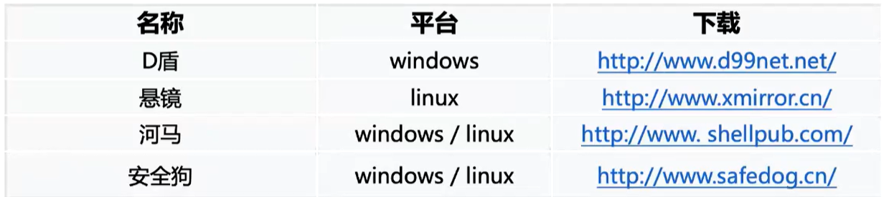

主机系统，web服务，框架，业务，CMOS，对内对外业务，子公司业务。

## 给客户的话

我要在服务器上传一些webshell查杀工具


1.遇事先汇报，先问上级，取得客户同意再去做。

2.传什么文件，先给客户，让客户去传。

不能向客户要求网络拓扑信息，只能问这边有没有提供网络拓扑信息

OA账户，邮箱账户信
一开始要上去看安全设备的版本，规则库，并记录，查询这个版本是否有什么已知问题。

1.通过css，设置像素点或者页面颜色一致，挂黑链。
3.设置div，使得权重变高，之后通过js修改div里的显示属性。 

2.页面劫持，js劫持，header劫持（抓包去看），服务器端的劫持，

```html
//自动刷新并转向
<meta http-equiv="refresh" content="10;url=http://www.baidu.com">
```

有的时候会有一个专门的进程占用并监控当前文件，不断往文件里写内容，此时你可以备份确定，cat之前先备份是个好习惯。



发现黑客工具

chattr 000 xxxx.elf

chattr +i   不能被删除、更名、设定链接，也无法写入数据 

## 一些发现替换文件的办法

1.ls -alt根据时间列出

2.stat 看access（最后一次访问时间，先做记录，不然会改变）、change、modify三个时间，；

3.find根据时间段列出文件

```
//查找特定目录下最近一天的文件
find /var/log -type f -mtime -1
```

## 异常流量判断

异常端口

端口上的异常协议

> 80上面全是HTTP流流量，但只有一个公共IP进行了TCP流量

异常方向，从内到外的SMB；


## 把所有IP在微步跑一遍

