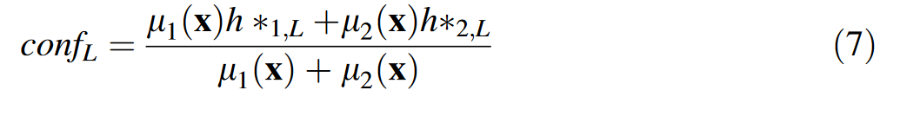
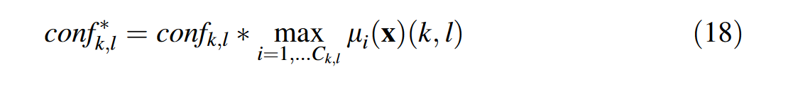
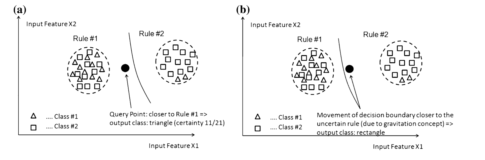

> 主动学习，半监督学习的一种，让模型决定哪个数据点被打标签，减少执行任务所需要的监督量。
>
> 用在 犯错误成本很高，而请求标签成本较小的领域中。
>
> 方法：某些example提供最多的信息，某些数据打什么标签具有极大的不确定性。传统的办法是
>
> **启发式的来近似风险**

```
For: Input
模型可以选择自己预测对应的标记（如果预测对了就会给一个奖励，预测错了会给一个惩罚），
也可以选择索要正确的标记（直接给一个小的惩罚）
```


## Single-pass active learning with conflict and ignorance.

> 2012,Single-pass active learning with conflict and ignorance.伴随冲突（对类的相交样本建模，可信确定度在0.5~0.75）和忽略（炒鱿鱼度<0.5，离类很远的样本）的单程主动学习

### 模糊系统里的一些概念

member degree 成员度，规则内的样本比例

maximal firing degree 规则的最大触发程度，使用ε完整度评价。

引入一个筛选模型，评价样本的不确定性（冲突和忽略）。通过选取信息含量最多的样本减少标注量。汇总各个二分类器的分类偏好打分得到最终结果，可以在达到相似分类效果的前提下减少90%的样本选取。

启发：天然信息含量高的个体具有什么特性，如何增加样本的信息含量？



选取信心分数在0.7以下的

对于在所有二分类器上覆盖度不良的样本，结合覆盖度和确定性标准决定它的最终标签和冲突度。



决策边界的非线性越强，权重应该越低，外推区域里的样本的不确定性越强。

> 2011,evolving fuzzy classifiers

EFC（进化模糊分类器）架构能够反映当前数据的分布特点。



由于重力概念，决策边界要偏向类混杂的规则，而远离纯净的规则。？？？

偏好关系矩阵，可以拆分为三元组(严格偏好，，无法比较关系)

一些通过在线流和新样本可进化的学习算法：增量支持向量机、Hoeffding trees、on-line bagging and boosting (Oza 2001), incremental decision trees (Utgoff 1989), incremental min-max neural network (Bouchachia 2009), semi-supervised k-nearest neighbors (Hartert et al. 2010), and evolving fuzzy classifiers (Lughofer 2011) (Angelov et al. 2008).


>Settles B (2010) Active learning literature survey. Technical report, Computer Sciences Technical Report 1648, University of Wisconsin Madison