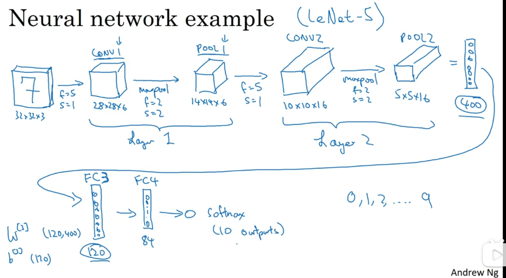
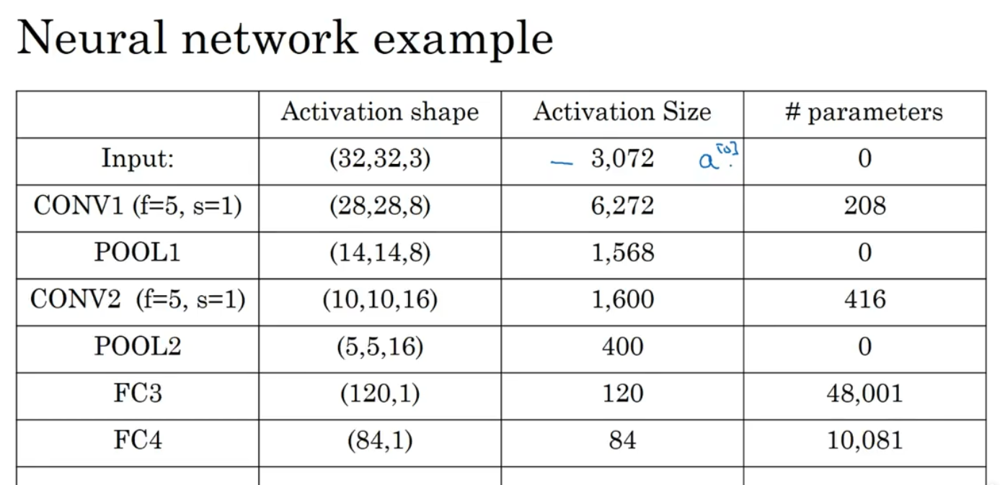

> [CNN_EXAMPLE](https://www.bilibili.com/video/BV1e54y1b7uk?p=10)

## 1. pooling layer

>减少展示信息，以加快计算，还能增强检测到的特征的鲁棒性。

### Hyper parameter

- f: filter size
- s: stride
- type:Max or average pooling
- 用的很少的：p=0--padding

这是一个确定的函数，手动输入或者交叉检验，不需要学习获得。

<!-- more -->

相当于f=2,stride=2（Maxpooling的超参数）的一个过滤器；

独立作用于各个`channel`

近似于把高、宽均缩小了两倍以上；

收集后的特征表明该特诊原来存在于原来的特征集合；没有收集到的表明特征可能不存在或者比较小。

### 输出大小

- Ouputsize: (n+2p-f)/s+1

### 层数惯例

惯例一：因为池化层没有权重和参数，所以**把卷积层和池化合一块称为一层**。

## 2. Fully connected layer

就是神经网络的单层网络而已；被叫做全连接是因为输入的每一个分量都与该层的所有结点相连。

Hyperparameter:

- W=[w1,w2,...wm]
- bias

### 一张图---->识别出一个数字

a随着层数的加深，高、宽减小，而通道数增加。

激活的输入量在减少。

### 参数的计算

5*5的filter+1个bias=26；26x8=208;

### 参数的选择

抄别人文献里的。

### 为什么卷积网络可以减少参数

- 参数共享：一个卷积核可以做很多次运算
- 

