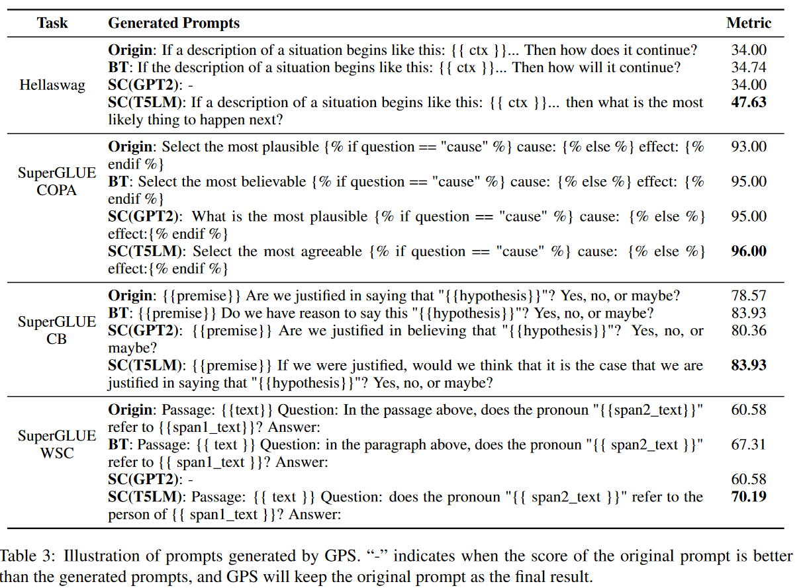

[GPSCode-06](https://github.com/hwxu20/gps)

- Hanwei Xu, Yujun Chen, Yulun Du, Nan Shao, Wang Yanggang, Haiyu Li, and Zhilin Yang. 2022. [GPS: Genetic Prompt Search for Efficient Few-Shot Learning](https://aclanthology.org/2022.emnlp-main.559). In *Proceedings of the 2022 Conference on Empirical Methods in Natural Language Processing*, pages 8162–8171, Abu Dhabi, United Arab Emirates. Association for Computational Linguistics.

## 背景

用自然语言指令设置提示词，可以提高零样本设置中大型语言模型的任务性能。当前工作通过手动重写或基于梯度的调整来改进此类提示词。 然而，

手动重写非常耗时并且需要主观解释，

而基于梯度的调整对于大型模型的计算要求极高，并且需要完全访问模型权重，这对于基于 API 的模型可能不可用。

基于提示词的方法有利于小样本泛化，但是之前的都是手动设置，本文用遗传算法去进行提示词搜索。

## 术语介绍

intrinsic dimension(本征维)： 在多维信号的信号处理中，信号的本征维描述了生成信号的良好近似需要多少变量。 

T0:多任务encoder-decoder模型，针对不同下游任务，人为设计不同的提示词预训练后获得。

### 以下均为需要微调参数的方法

BBT(Black-Box Tuning)： 无梯度的微调方法，搜索连续空间中的最佳软**提示词嵌入**，而不是搜索离散的文本提示词。

MT(Model Tuning)：在**每个任务上对整个**预训练语言**模型**进行微调的通用范式

PT(Prompt Tuning)：预训练模型被冻结，**只训练额外的连续软提示词**的梯度引导的微调方法

### 无须微调参数的方法

- ICL(In-Context Learning):上下文学习，大规模预训练模型进行小样本学习的通用方法。

  由标注的样本和**手动模板**组成的**范例**被用来帮助模型理解test tasks的含义。

  缺陷：需要人工提供手动提示词，对标记数据敏感，表现不稳定。

- GRIPS（  Gradient-free Instructional Prompt Search) ：无梯度指令提示搜索，基于编辑的优化提示词搜索方法，主要用于简单的基于编辑的操作（例如增、删、交换、释义）

​									Table4  五种小样本学习方法在四个评价指标上的比较

> 这里的代价消耗是训练和提示词搜索的联合损失。
>
> 可以看到，本文提出的方法GPS提供Serving Effiency、使得可微调参数量为0、极大的减少了计算代价，还能取得接近于整个模型调优的效果。获得了60.12的     ？？？。
>
>  上下文学习使用很长的序列长度来串联例子，推理昂贵，那为什么这里的代价只是1x？？？

## 实验设置

|       |                                                              |
| ----- | ------------------------------------------------------------ |
| PT    | Adafactor Optimizer，lr=0.05                                 |
| MT    | Adafactor Optimizer，,lr=5e-5=0.00005                        |
| BBT   | 本征维度=500，pop size=20，使用交叉熵损失；                                             软提示词标记数量为1,50时结果最好 |
| ICL   | 每个task随机从训练集挑2个样本                                |
| GRIPS | 复用arXiv:2203.07281.里的超参数，将初始提示词换成T0的        |

​										Table3 GPS产生的提示词的解释 

>

## 我的未来工作

GPT-3表明，在超大规模预训练语言模型上使用提示词进行小样本学习效果良好；

> Brown et al., Language models are few-shot learners. NIPS,2020

但对于每个特定任务找到最优化的提示词很困难。

To模型来源于这篇论文——Sanh et al., 2021. Multitask prompted training enables zero-shot task generalization.