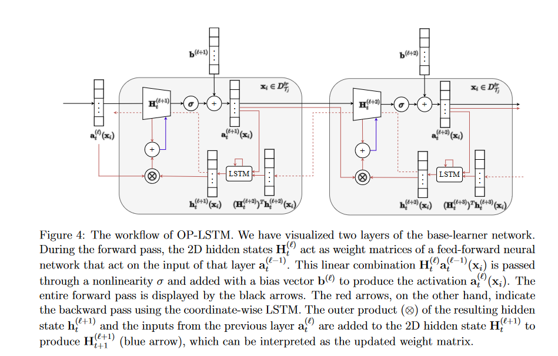

> 看论文，C刊及以下的一般不看介绍和相关工作部分，只看一眼本文贡献。

面对一项新任务时，LSTM的权重是固定的。

1.支持集的隐藏嵌入层并不是排列不变的。-->通过对训练样本的平均池化

2.学习算法和输入嵌入机制交错，带来优化挑战和增加过拟合风险-->解耦

## LSTM

只是获取给定任务的训练数据，并根据生成的隐藏状态来调整新查询输入的预测。把支持集当作序列而非集合

LSTM's predictions for unseen inputs (queries) are conditioned on the hidden state h_M and cell state c_M .

- Should make the hidden embedding be invariant to the order in which the examples are fed into the LSTM.

## Outer Product LSTM

通过加上生成的隐状态和前一层输出的外积来更新当前隐藏矩阵。

adjusting the weights of the LSTM using backpropagation across different tasks

does not update the biases

base-learner ：

- Use an LSTM to learn the weight update rule 

- good initialization parameters 

## Performance

与四种方法作对比：MAML、prototypical network、SAP、Warp-MAML；

在两类问题：few-shot sine wave regression、image classification benchmarks

分类是在三个数据集上：

- Omniglot
- miniImageNet
- CUB

within-domain few-shot image classification

## 实验部分设计

**实验的随机种子，会影响初始化权重值，以及训练、测试、验证任务集。**

2.测量更新方向之间的余弦相似度作为反距离度量，余弦相似度可以更好地衡量方向相似度，因为它从向量的大小中抽象出来。

3.用-表示在限制的资源下，实验并没有运行完成。

4.使用足够大隐藏维度的 LSTM 可以通过使用隐藏表示的前 N 个维度来执行学习并为下一个时间步**保留重要信息**，并使用剩余维度来表示输入表示，从而将学习与输入表示分开。

### Cross-domain

拿两个数据集，在一个数据集上训练，在另一个数据集上校验，但是要保证两个数据集没有交叉？？？

Frobenius norm

## 一些吹嘘

作者一直在说OP-LSTM与其他方法正交，可以和其他方法同时使用，但是把它们留在了未来工作。