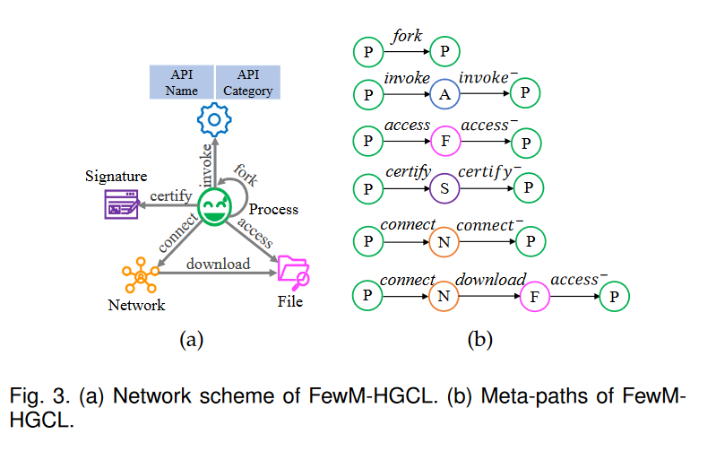
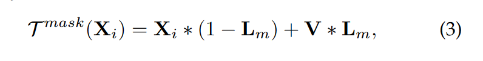
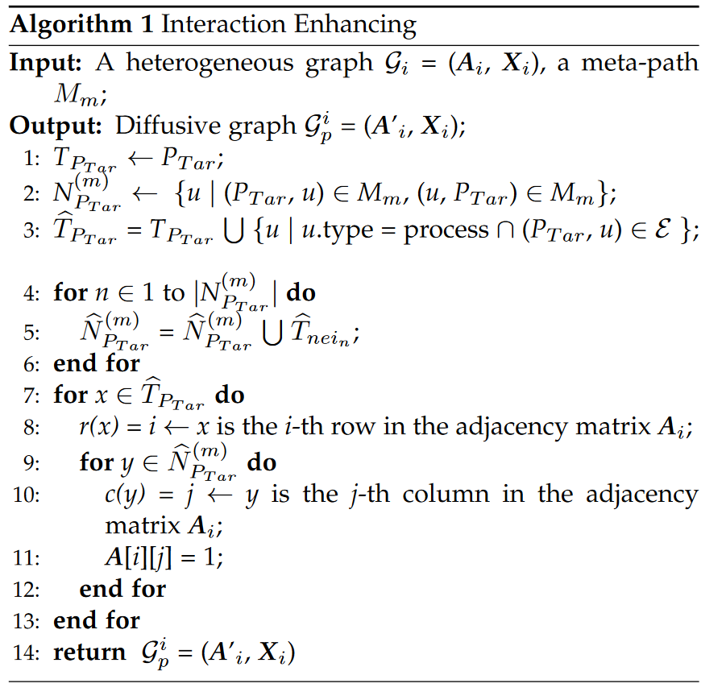
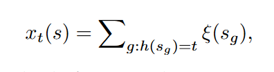
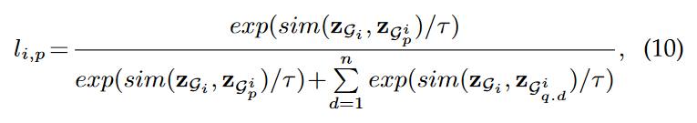
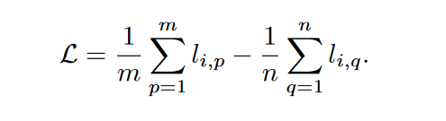
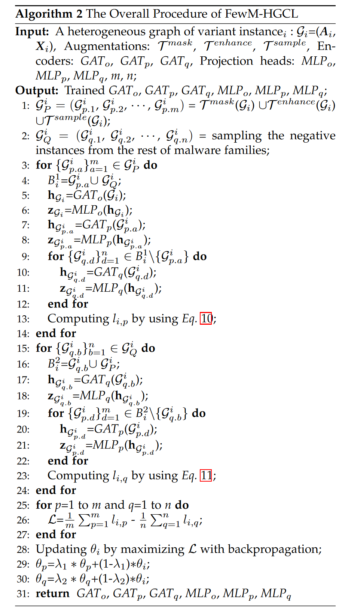

> Chen Liu, B. Li, J. Zhao, Z. Zhen, X. Liu and Q. Zhang, "FewM-HGCL : Few-Shot Malware Variants Detection Via Heterogeneous Graph Contrastive Learning," in IEEE Transactions on Dependable and Secure Computing, doi: 10.1109/TDSC.2022.3216902.


## 背景

BPNN,API嵌入

1.以往的方法忽略了各种特征之间的上下文关联，容易被多态性变体规避。恶意软件各个**实体间细粒度的交互信息**，能揭示恶意软件变体的内在模式。

传统机器学习方法无法检测隐蔽少样本的变种、零日攻击。没有使用API调用的属性信息。

2.以往的对比学习方法关注图数据或者同构图结构化数据的生成，对复杂的异构图结构数据生出的研究很少。

传统的对比方法关注同构图正负实例生成，忽略了异构依赖关系。与同构图中的单个依赖关系不同，异构图中各种恶意软件实体之间存在许多**非线性和分层异构依赖关系。**




process, API, file, network, and signature，五种实体之间的六种关系。


CRAO命名规则

```
[<type>://][<platform>/]<family>[.<group>][.<length>].<variant>[<modifiers>][!<comment>]
```

对比学习的直觉是利用**数据固有的共现关系**       作为自我监督，通过其内在的判别机制学习匹配模式并捕获不匹配模式。

基于异构图的监督学习检测方法可检测传统变异


## 前提知识

图神经网络对于关系型数据效果很好。

每个样本的异构图[1]都会通过图像增强{API属性掩蔽（语义信息，对属性矩阵Xi)、交互增强和元路径采样（结构信息，对临接矩阵Ai进行转换)  }生成m个正样例[2]，从其他恶意软件家族挑出n个负样例[3]，对这三种对象，分别采用一个图注意力网络生成 图级别的嵌入表示，进而组合成图样本对，分析样本对的一致性，给出样本的家族预测。

定义5  基于原路径的显示领域（从目标节点出发，沿着元路径能够到达的节点集合）；基于交互增强的领域（显示领域的0阶邻居+1阶进程邻居）

## 一些结论：

You等[32]认为节点邻域重构属于局部-全局对比，过分强调邻域信息会破坏结构信息。

## 方法

1.如何对小样本实例的大貌和细粒度进行建模；

2.如何设计恶意软件变体异构图的有效的正负样本对

3.如何学习到异构图的图级表示。  GAT

4.判别方法

### 1.基于特征哈希的密集属性异构图

> [42]对于大规模多任务学习的特征哈希方法

### 2.三种数据增强方式

3.2.1随机屏蔽所有API节点的部分属性。



Lm表示遮罩位置矩阵，V表示服从正态分布的随机高斯噪声。

3.2.2 交互增强

同质图数据增强都集中在原始图的随机扩散；



第3~6行，对进程节点和邻居的关系权置为1，兼顾语义和搜索速度。

3.2.3 基于(具有区分性的预定义的六种)元路径采样所有可达节点


### 4.基于经济动量策略的判别器

> [23]无监督视觉表示学习的动量对比

节省计算开销，三个编码器和三个投影头的计算->只反向传播GATo和MLPo，其余模型的参数基于动量进行更新。



i的正例的损失：



预设的温度参数τ，

最终损失，是m个正例的平均损失-n个负例的平均损失。






## 数据集

小样本恶意软件数据集要求：

- 涵盖足够多的家族

- 每个家族应该有一个最新的实例

- 样本分布符合真实场景

## 实验

1.传统特征+传统模型（CNN，SVM+RBF,RNN+LR)

2.异构图+GNN，足够多的数据的监督学习

3.自监督方式：API+生成对抗自动编码器,Gaph Contrastive Coding

**BIG2015的使用**

BIG 2015数据集不适用于基于API的分析方法，它仅包含脱敏静态签名特征，只具有PP（进程fork)，PAP（进程调用APi)，PSP（进程签名）等三种元路径。RNN+LR、API+AAE生成对抗自动编码器、MatchGNet、MG-DVD均基于动态行为分析方法，因此BIG 2015数据集不能用于上述4种基线方法的实验验证


运行10次，比较平均结果。

1.四种常用数据集上的多分类任务，

2.其他的单个数据集上的二分类任务，

3、单个数据集上的（1,5）少样本任务，

4.未知恶意软件检测，以已知类型：未知类型=5:4,5:3的比例划分；

5.三种子方法的蒸馏实验（准确率的提高量gain） 动量值=0.990

6.时间空间偏差的实验（采用前半年数据集测试后半年的采用后半年数据集训练测试前半年的）

结论：恶意软件检测方法都**能够根据对未来变种的学习知识来检测过去的恶意软件**，但很难根据过去的恶意软件预测未来的变种。

7.基于t-SNE，t-分布式随机邻居嵌入的可视化

**结构级增强比语义级增强（遮罩）更有利于异构图对比学习。**

a.各个方法在各个数据集上的运行时间比较，

b.mask参数设置，0.5最佳，对属性密集的数据集作用更大；FewM-HGCl在shot变化时准确率的影响，1到5明显升高，10个时基本到头。

layers的设置，不同数据集不同，L_Big-2015=2；embedding=64时最佳。


## 讨论

无法处理反沙箱恶意软件，无法处理复杂的打包恶意软件

新思路：利用不同实体之间的特定时间依赖关系进行动态建模和在线检测


## 参考文献


[22] A. v. d. Oord, Y. Li, and O. Vinyals, “Representation learning with contrastive predictive coding,” arXiv preprint arXiv:1807.03748, 2018.

[23]K. He, H. Fan, Y. Wu, S. Xie, and R. Girshick, “Momentum contrast for unsupervised visual representation learning,” in Proceedings of the IEEE/CVF Conference on Computer Vision and Pattern Recognition, 2020, pp. 9729–9738.

[32] Y. You, T. Chen, Y. Sui, T. Chen, Z. Wang, and Y. Shen, “Graph contrastive learning with augmentations,” Advances in Neural Information Processing Systems, vol. 33, pp. 5812–5823, 2020

[42]K. Weinberger, A. Dasgupta, J. Langford, A. Smola, and J. Attenberg, “Feature hashing for large scale multitask learning,” in Proceedings of the 26th annual international conference on machine learning, 2009, pp. 1113–1120.


 Li, Zhenguo et al. “Meta-SGD: Learning to Learn Quickly for Few Shot Learning.” *ArXiv* abs/1707.09835 (2017): n. pag. 

 Sun, Qianru et al. “Meta-Transfer Learning for Few-Shot Learning.” *2019 IEEE/CVF Conference on Computer Vision and Pattern Recognition (CVPR)* (2018): 403-412. 

 Liu, Yanbin et al. “Learning to Propagate Labels: Transductive Propagation Network for Few-Shot Learning.” *International Conference on Learning Representations* (2018). 

 Ye, Han-Jia et al. “Few-Shot Learning via Embedding Adaptation With Set-to-Set Functions.” *2020 IEEE/CVF Conference on Computer Vision and Pattern Recognition (CVPR)* (2018): 8805-8814. 

