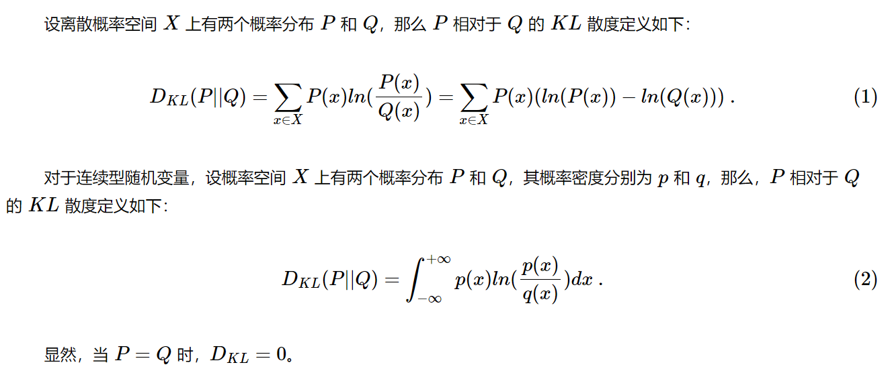

> Few-Shot Learning With a Strong Teacher,  2024-Mar ,IEEE TRANSACTIONS ON PATTERN ANALYSIS AND MACHINE INTELLIGENCE 

## Abstract

背景（元学习存在的问题）：

采样的查询样本为元学习器提供的监督信息不足；

元学习器随着样本数目增多，效果的增加不如强学习器。

思路：

改变元学习器的目标为“表现接近强学习器”。

具体做法：

每一个采样的小样本任务都设置一个目标强学习器，用目标强学习器去监督元学习器。

关键：如何构造强学习器？

## 3.MODEL

### 相对熵

KL 散度（Kullback–Leibler divergence，缩写 KLD）是一种统计学度量，表示的是一个概率分布相对于另一个概率分布的差异程度，在信息论中又称为相对熵。

可以衡量用Q表示P带来的信息损失。

###  最近质心 分类器NC(Nearest Centroid)

1.求类平均值

2.度量距离

### 元训练阶段，最佳分类器的训练

增强老师（效果更稳定）或者弱化学生，都可以提高蒸馏或自训练表现。

a.变动 输入图片的尺寸（图片size越大，准确率越高）只在构造和查询最佳分类器时增大图片尺寸，不对元学习器的构造和各任务分类器的生成进行该操作，以和基线统一标准。

b.对输入做自动增强

> [102]E. D. Cubuk, B. Zoph, D. Mane, V. Vasudevan, and Q. V. Le, “Autoaugment: Learning augmentation strategies from data,” in CVPR, 2019, pp. 113–123.

样本集的分割比例参考

>S. Ravi and H. Larochelle, “Optimization as a model for few-shot learning,” in ICLR, 2017.