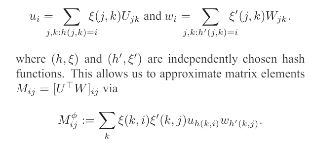
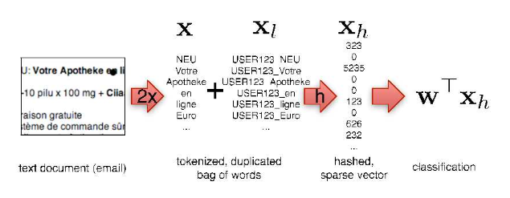
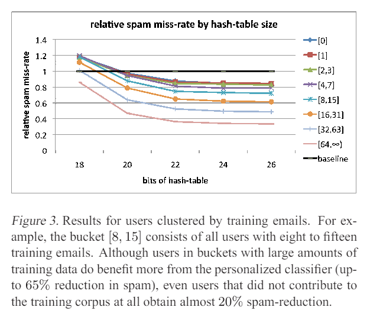
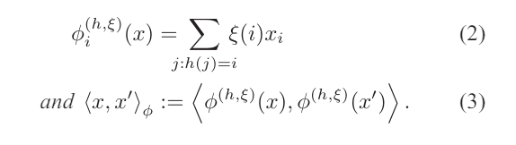

特征散列的优点在于它能够**显著压缩参数**向量的存储。通过散列，我们能够将其减少到O(m) 个数字，同时**避免**局部敏感散列中常见的高成本矩阵向量乘法。此外，结果向量的**稀疏性**得以保留。

固定向量表示的长度后，引入一个哈希函数ξ(f)，输出值为±1；

```python
#f是func，v是vocabulary
for f, v in sample:
    vector[h(f) % n] += ξ(f) * v
```

> sklearn中的实现
>
> https://scikit-learn.org/stable/modules/feature_extraction.html#feature-hashing

## 应用场景

特别是，内存受限时，特征哈希非常有用。


消除频繁标记减少参数的存储量会导致攻击者创建非常不频繁但典型的垃圾邮件标记。如果所有单词都被散列成一个有限大小的特征向量，那么不频繁但类别指示性的标记就有机会对分类结果做出贡献。


大规模多类估计我们还可以**将大规模多类分类视为多任务问题**，并以类似于个性化设置的方式应用特征哈希。我们不是为每个用户使用不同的哈希函数，而是为每个类使用不同的哈希函数。

## WW研讨

Roberata+ 	CLF\LSTM

 Conditional Latent Field，条件调解场 

能够在考虑上下文信息和依赖关系的同时，学习数据中的隐含结构。 


 变分推断是一种强大的近似推断方法，通过将推断问题转化为优化问题，可以高效处理复杂的概率模型和**高维数据**。其广泛的应用和灵活的适应性使其成为贝叶斯统计和机器学习中的重要工具。 

## 大稀疏矩阵的分解



将用户和每个Token链接后再做hash.



当将文档表示为词袋时，
因为我们可能只是对常用词进行多次哈希处理

## 评价指标

### 错误分类率，相对基线未捕获到的恶意邮件数量

恶意邮件里，把正确的邮件错误分类为恶意是无法容忍的；而对于恶意软件，把恶意错误分类为良性是无法容忍的，定义恶意软件为P，则要求召回率尽可能高。




一种有效的评价方法。把用户根据其贡献的邮件数量排序放入桶里，衡量对于不同的桶，垃圾邮件的错误分类率是否下降。


22，24,26的哈希位数可以让垃圾邮件的错误率下降到最低；

20,000的固定特征长度效果基本达到顶峰；

独立哈希子空间之间的干扰可以忽略不计，并且概率很高，这允许在非常压缩的空间中进行大规模多任务学习。

每个有限长度的字符串可以表示为一个自然数字。



把每个维度映射到±1，再求累计和。

哈希值的符号决定了特征存储在输出矩阵中的值的符号。这样，冲突可能会抵消而不是累积错误

## 专有名词

Lemma 引理

Theorem 定理

Corollary 推论

