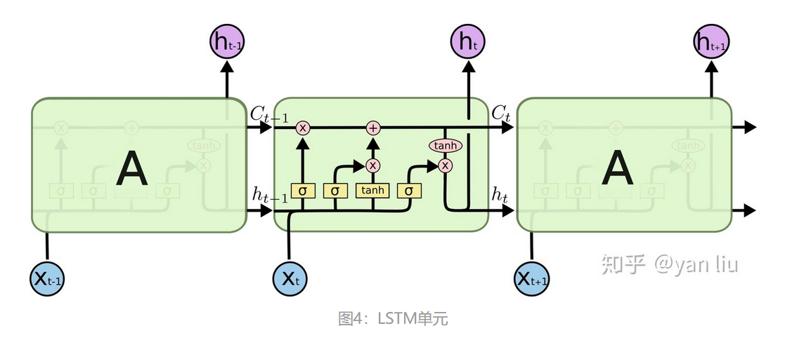

## RNN

RNN是一个链式结构，每个**时间片**使用的是**相同的参数**。

输入数据要序列化；

具有记忆性、时间维度上权值共享且图灵完备，能够以极高的效率学习序列中的非线性特征。


​                                                                            1-1   循环神经网络示例


```latex
h_{t}=\sigma\left(x_{t} \times w_{x t}+h_{t-1} \times w_{h t}+b\right)
```

其中，w_{h t}，为状态权重。

### 存在的问题

**长期依赖问题**：

隐藏状态h_t只能存储有限的信息，当记忆单元存储内容多时，它会逐渐以往之前所学到的知识（着数据时间片的增加，RNN丧失了连接相隔较远的层之间信息的能力）。

长期依赖的现象也会产生很小的梯度。

**梯度消失。梯度爆炸**

权值矩阵循环相乘导致。因为RNN中每个时间片使用相同的权值矩阵，相同函数的多次组合会导致极端的非线性行为。

- 处理梯度爆炸可以采用梯度截断的方法。所谓梯度截断是指将梯度值超过阈值\theta的梯度手动降到\theta 。虽然梯度截断会一定程度上改变梯度的方向，但梯度截断的方向依旧是朝向损失函数减小的方向。
- 处理梯度消失？？

### 解决办法

引入门控机制，选择性遗忘一些无用信息，从而控制信息的累积。

## LSTM

> 参考[知乎-详解LSTM](https://zhuanlan.zhihu.com/p/42717426)

1997年由Hochreiter & Schmidhuber提出

>Hochreiter, S, and J. Schmidhuber. “Long short-term memory.” Neural Computation 9.8(1997):1735-1780.





[激活函数](https://m.thepaper.cn/baijiahao_11444171)

