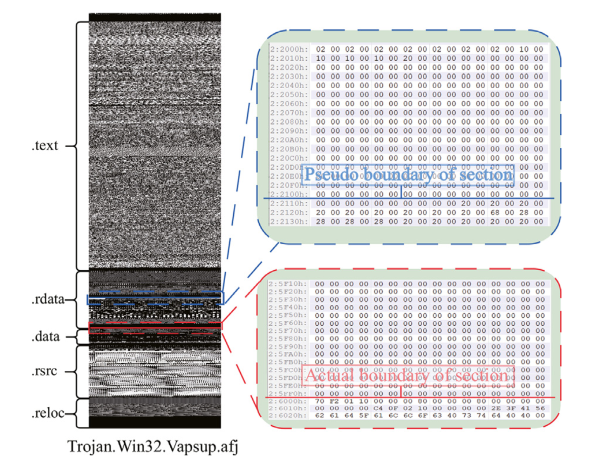
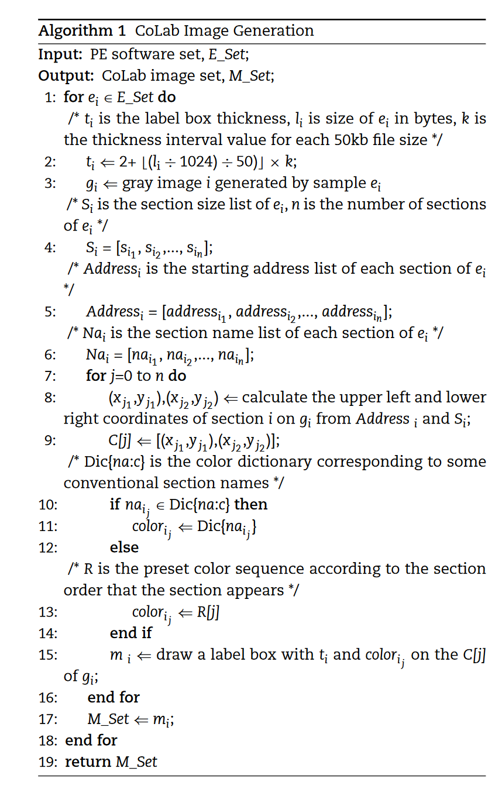
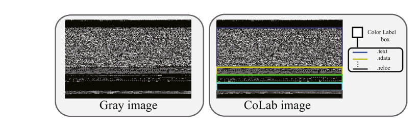
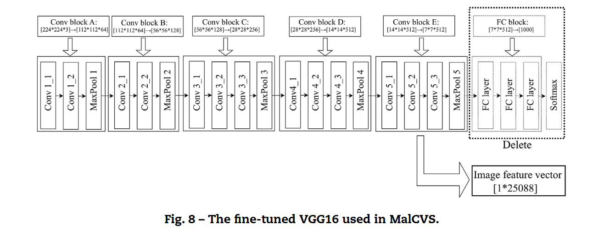
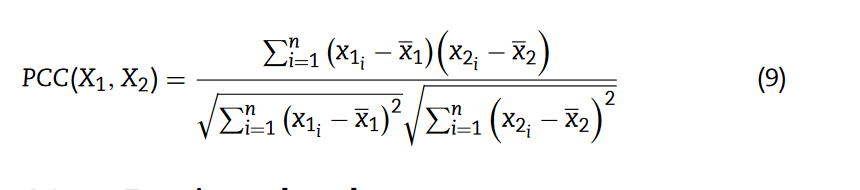

> Image-based malware classification using section distribution information,发表在B刊，Computers&Security,2021.

本文不是小样本,第20篇论文。

## Idea

虽然需要大量的计算，但是输入数据里选取的数据的信息越多，准确率越高。

作者的想法和我的想法：节表的分布信息能够更好的表征恶意软件。

## 动机

已有的灰度图里，相同家族的样本具有相似的二级制内容和图片纹理。

**相同家族的样本具有相似的节表分布信息，节表数量、节表顺序和节表尺寸。**

##  方法

和我的思路一致，从Opcode、Gray变为了带有节表信息的灰度图。

VGG16+多分类SVM。

## 注意

只能处理未打包的恶意软件，这样才能够保证节表的分布信息没有被混淆。

## 细节

### 灰度图评价

PE文件里由于文件对齐，会有大量的填充数据（0或其他值），而各个样本填充的位数不一致。

如下图所示，灰度图里的界限和实际的界限对应得并不是很好。

已有的灰度图里能够判断出一部分节表信息，但是会有很多错误 。

### 作者提出的 算法

图片定宽256（16的倍数，hex视图），高度跟随文件大小变化。用于对节表分界的**行厚度要发生变化**，

 

### 最后分类模型的选取

25088的数据维度，维度诅咒以及数据稀疏。

SVM适合处理高维数据，它的计算复杂度取决于它的支持向量数，而不是空间维度。

SVM处理大规模数据效果也很好。

## 其他

### 数据集

VXV：[VX-Heaven](https://archive.org/download/vxheavens-2010-05-18) VirusShare

BIG-2015微软恶意软件分类数据集

### 实验设置

### 皮尔逊相关性系数

衡量两个向量的线性相关性。

采用平均PCC去衡量一个家族内的样本用某一种形式表示时的相似度。