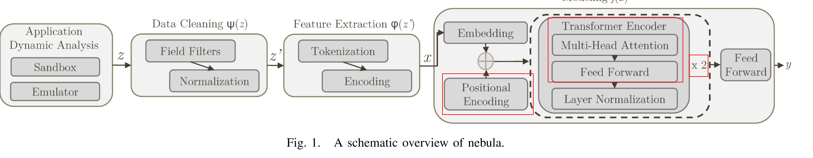
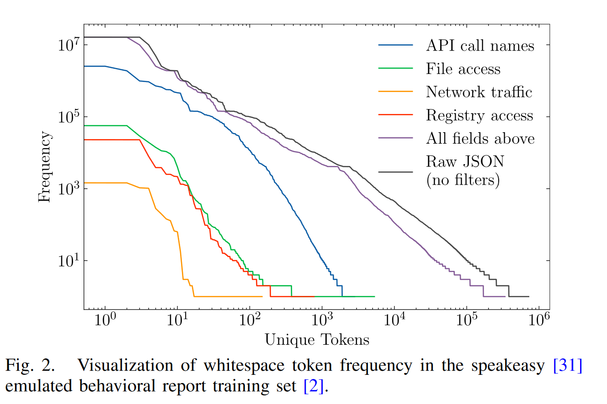

> Jung, Y., 2017. Multiple predicting K-fold cross-validation for model selection. *Journal of Nonparametric Statistics*, pp.1-19 

## 创新点及贡献点

使用了API+行为特征；

**2.消融实验证明组件的必要性；**

**3.三组数据集上开展试验**

4.做了多分类和二分类任务

**5.做了20%数据的全监督学习和自监督学习的效果对比；**

**6.可解释AI技术；**

7.公开了源码

## 交叉验证中K值的选取

小数据集中，K值一定要取一个较大的值，否则用于训练的数据量过少。

K值会影响模型的方差和偏差。

> M. Sundararajan, A. Taly, and Q. Yan, “Axiomatic attribution for deep networks,” in Proc. Int. Conf. Mach. Learn., 2017, pp. 3319–3328.

## 统一梯度

利用消融实验决定是否原样(as-is)采用组件，还是修改或加入领域知识后使用。

## 可解释AI

## 模型架构

