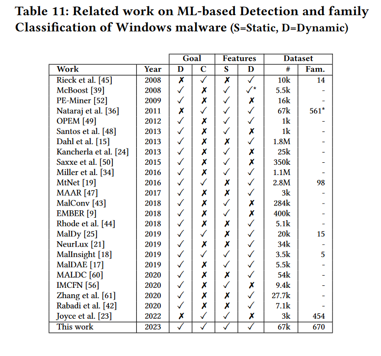

Decoding the Secrets of Machine Learning in Windows Malware Classification: A Deep Dive into Datasets, Features, and Model Performance

Savino Dambra

结论

- 静态特征的性能优于动态特征，而将两者结合起来只能提供比静态特征的边际改进。
  - 静态特征对于已知家族的样本检测已足够，基于动态特征的模型主要用来处理未知家族样本。
- 打包和分类准确性之间没有相关性
- 动态提取的特征中缺失的行为会严重影响它们的性能。
- 要分类的族数量越多，分类就越困难，而每个族的样本数量越多，准确性就越高。
  - 在 600 个家庭中 F1 得分为 0.89 的家庭分类器可能优于 30 个家庭中得分为 0.93 的分类器。
- 各家族样本均匀分布的数据上训练出的模型在未知数据集上泛化效果好。

> [11] Daniel Arp, Erwin Quiring, Feargus Pendlebury, Alexander Warnecke, Fabio Pierazzi, Christian Wressnegger, Lorenzo Cavallaro, and Konrad Rieck. Dos and Don’ts of Machine Learning in Computer Security. In USENIX Security 22.

由训练样本抽样和不准确的类标签标记引入的统计偏差可能会在 ML 分类器中引入虚假相关性。

## 问题：

不平衡数据集上训练的模型在不同分布的测试集上泛化效果差。如何破解？

如何缓解动态检测时缺失特征对结果的影响？

现实研究往往是超多分类任务，如何保证这个超多分类低消耗的在用户电脑上运行？

大多数 ML 模型都遵循一个核心假设：ML 模型的训练和测试数据应该相同且独立于相同的底层分布，即 I.I.D. 假设。然而，I.I.D假设在实践中并不成立。

在测试阶段采用不适当的性能指标而忽略类别不平衡可能会导致对基于 ML 的预测分析质量的错误解释。

## 思路：

静态检测，高于某个可信度区间时，直接给出静态检测的结果；在达不到可信度时，开启动态检测，综合得到结果。（兼顾性能和准确率）

直接二进制程序上进行动态恶意软件检测

原始字节

[21]Chani Jindal, Christopher Salls, Hojjat Aghakhani, Keith Long, Christopher Kruegel, and Giovanni Vigna. 2019. Neurlux: Dynamic Malware Analysis without Feature Engineering. In Annual Computer Security Applications Conference.

API序列

[43] Edward Raff, Jon Barker, Jared Sylvester, Robert Brandon, Bryan Catanzaro, and Charles K Nicholas. 2018. Malware Detection by Eating a Whole EXE. In Workshops at the AAAI Conference on Artificial Intelligence.

二进制分类准确率的空间和时间偏差。

