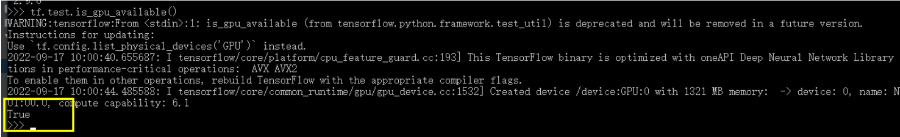

## 0.(可选)NVIDA官方下载对应驱动

> 选择界面：https://developer.nvidia.com/cuda-downloads

 [cuda_12.1.0_531.14_windows.exe](https://developer.download.nvidia.com/compute/cuda/12.1.0/local_installers/cuda_12.1.0_531.14_windows.exe)

下载后双击安装，等待安装成功；查看当前的cuda驱动版本。

```
C:\Users\22154>nvidia-smi
       CUDA Version: 12.1     |
```

## 1.安装cuda

> [WSL-Ubuntu-cuda下载，注意cuda版本和之前Windows上的对齐](https://developer.nvidia.com/cuda-12-1-1-download-archive?target_os=Linux&target_arch=x86_64&Distribution=WSL-Ubuntu&target_version=2.0&target_type=deb_local)

```
wget https://developer.download.nvidia.com/compute/cuda/repos/wsl-ubuntu/x86_64/cuda-wsl-ubuntu.pin
sudo mv cuda-wsl-ubuntu.pin /etc/apt/preferences.d/cuda-repository-pin-600
wget https://developer.download.nvidia.com/compute/cuda/12.1.1/local_installers/cuda-repo-wsl-ubuntu-12-1-local_12.1.1-1_amd64.deb
sudo dpkg -i cuda-repo-wsl-ubuntu-12-1-local_12.1.1-1_amd64.deb
sudo cp /var/cuda-repo-wsl-ubuntu-12-1-local/cuda-*-keyring.gpg /usr/share/keyrings/
sudo apt-get update
sudo apt --fix-broken install
sudo apt-get -y install cuda
```

## 2.安装conda并新建环境

```
conda create -n tf2.9 python=3.10
```

## 3、激活环境

```
conda activate tf2.9
```

## 4.安装Pytorch

>https://pytorch.org/get-started/locally/


复制粘贴上面的命令去Linux下运行即可。


···

```
pip3 install torch torchvision torchaudio
```


## 5.下载 tensorflow_gpu-2.9.0 （根据需求选择）

命令行打开到Computed-Tomography-AI目录，执行下面的命令。

```
(tf2.9) D:\DataSet\Github\Computed-Tomography-AI>
pip3 install -i http://pypi.douban.com/simple/ -r requirements.txt --trusted-host pypi.douban.com
```

安装其他版本，可以去 [tf官网]( https://tensorflow.google.cn/install/source_windows?hl=en#gpu )查看tensorflow、python、tensorflow-gpui、cuda、cudnn的对应关系 。

## 6.在对应环境中安装CUDAToolkit 

## 6.1conda挂代理或者换源

在这里进行换源，加速下载：

```
conda config --add channels https://mirrors.tuna.tsinghua.edu.cn/anaconda/cloud/msys2/
conda config --add channels https://mirrors.tuna.tsinghua.edu.cn/anaconda/cloud/conda-forge
conda config --add channels https://mirrors.tuna.tsinghua.edu.cn/anaconda/pkgs/free/
conda config --set show_channel_urls yes
```

## 6.2 conda下载cudatoolkit

```
 conda install cudatoolkit=11.2
```

## 7.conda下载CuDnn

```
conda install cudnn=8.1
```

## 8.(可选)手动下载CudaToolKIt和CuDnn

>https://anaconda.org/conda-forge/cudatoolkit/11.2.2/download/win-64/cudatoolkit-11.2.2-h933977f_9.tar.bz2

```
conda install --use-local cudatoolkit-11.2.2-h933977f_9.tar.bz2
```


## 9.验证是否安装成功

命令行下

```
py310paulc@BlackGame:~$ python
Python 3.10.13 (main, Sep 11 2023, 13:44:35) [GCC 11.2.0] on linux
Type "help", "copyright", "credits" or "license" for more information.
>>> import torch
>>> torch.cuda.is_available()
True
```

或者

```
(tf2.9) D:\DataSet\Github\Computed-Tomography-AI>python
>>>import tensorflow as tf
>>>tf.test.is_gpu_available()

```



 返回true说明没有问题。 

现在，所有的依赖项已经下载并配置成功。

## 安装pwndbg

Ubuntu18会缺少各种依赖，直接用它编译好的最快。

```
https://github.com/pwndbg/pwndbg/releases/download/2023.07.17-pkgs/pwndbg_2023.07.17_amd64.deb
sudo dpkg -i pwndbg_2023.07.17_amd64.deb
```


