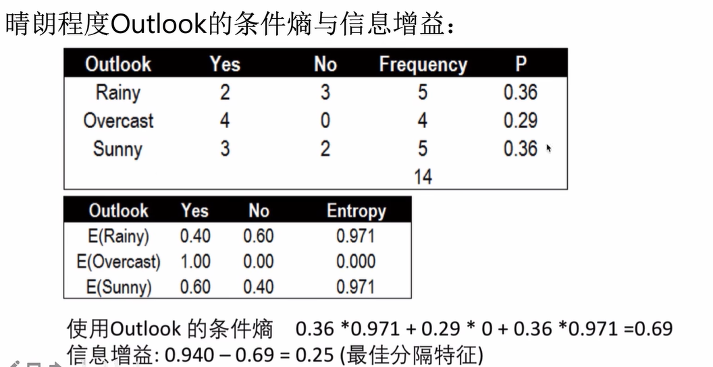
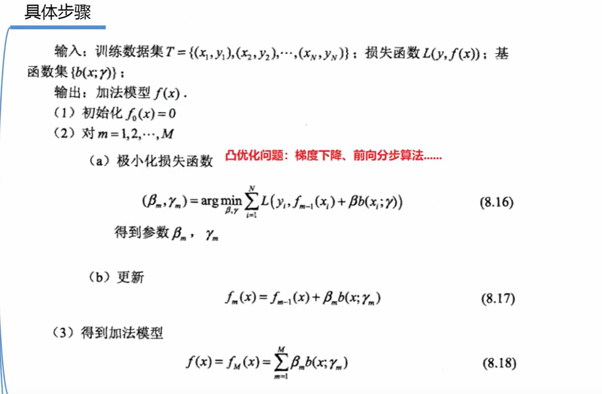

## 集成学习

- bagging: 随机森林

- boosting: adaboost,GBDT,XGboost，LGBM

## 决策树

- 分类树
- 回归树

### 信息熵

随机变量的不确定性，熵越大，不确定性越大。

```
H(X)=-\sum_{i=1}^{n} P(X=i) \log _{2} P(X=i)
```


比如，0.5、0.5的概率，不确定性很大，计算得到H(X)=1；而0.01,0.99的概率，不确定性减少，计算得到0.09；

### 条件熵

增加了条件限制后，不确定性会发生变化。

```
H(X \mid Y=v)=-\sum_{i=1}^{n} P(X=i \mid Y=v) \log _{2} P(X=i \mid Y=v)
```


### 信息增益

代表了在一个条件下，信息不确定性减少的程度，信息更容易被确定了，所以叫做增益。

I(X,Y)=H(X) -H(X|Y=v)  父节点熵-子节点加权熵

## 决策树的划分标准

信息增益越大的时候，决策树的划分越好。所以决策树的每一级决策，取信息增益最大的因素。

## 


## 使用xgboost库时的超参数

```python
model.set_params(max_depth=3,
                 learning_rate=0.1,
                 n_estimators=100,
                 silent=True,
                 objective="multi:softmax",
                 num_class=3)
```


```python
def __init__(
        self,
        max_depth: Optional[int] = None,
        max_leaves: Optional[int] = None,
        max_bin: Optional[int] = None,
        grow_policy: Optional[str] = None,
        learning_rate: Optional[float] = None,
        n_estimators: int = 100,
        verbosity: Optional[int] = None,
        objective: _SklObjective = None,
        booster: Optional[str] = None,
        tree_method: Optional[str] = None,
        n_jobs: Optional[int] = None,
        gamma: Optional[float] = None,
        min_child_weight: Optional[float] = None,
        max_delta_step: Optional[float] = None,
        subsample: Optional[float] = None,
        sampling_method: Optional[str] = None,
        colsample_bytree: Optional[float] = None,
        colsample_bylevel: Optional[float] = None,
        colsample_bynode: Optional[float] = None,
        reg_alpha: Optional[float] = None,
        reg_lambda: Optional[float] = None,
        scale_pos_weight: Optional[float] = None,
        base_score: Optional[float] = None,
        random_state: Optional[Union[np.random.RandomState, int]] = None,
        missing: float = np.nan,
        num_parallel_tree: Optional[int] = None,
        monotone_constraints: Optional[Union[Dict[str, int], str]] = None,
        interaction_constraints: Optional[Union[str, Sequence[Sequence[str]]]] = None,
        importance_type: Optional[str] = None,
        gpu_id: Optional[int] = None,
        validate_parameters: Optional[bool] = None,
        predictor: Optional[str] = None,
        enable_categorical: bool = False,
        max_cat_to_onehot: Optional[int] = None,
        eval_metric: Optional[Union[str, List[str], Callable]] = None,
        early_stopping_rounds: Optional[int] = None,
        callbacks: Optional[List[TrainingCallback]] = None,
        **kwargs: Any
    ) 
```


## 随机森林

随机性：1.样本随机选取作为某一个DT的训练集；2.特征随机选取

## Adaboost前向优化算法



